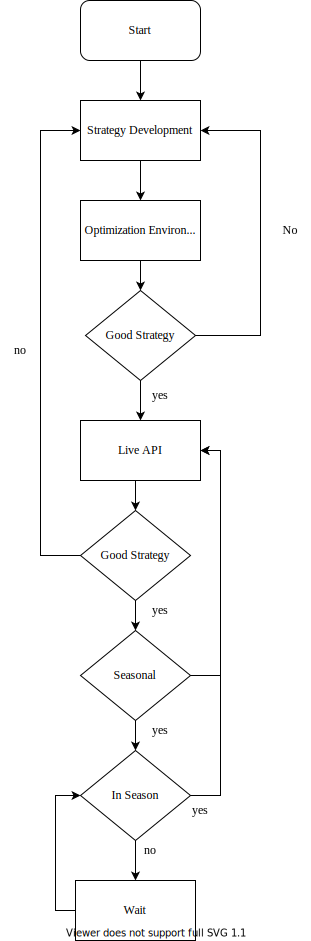
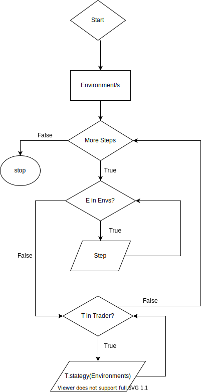

# Nibbler Design Docs

## Introduction

The nibbler trading package provides an environment for optimizing trading algorithms, as well as a direct API to several exchanges (as of now only Binance is available).

## Strategy Optimization

To develop a trading strategy not only is a back test necessary to confirm the effectiveness of the strategy, but the parameters of the strategy must be optimized to maximize the strategy's effectiveness. We can alternatively think of optimization as strategy training, and hence the two terms can be used interchangeably. To both perform the back tests and parameter optimization an environment which mimics live trading must be developed. The closer the environment is to the real trading experience the lower the discrepancy will be between the optimization and live performance. In this section of the design documentation we provide an overview of the optimization environment.

### High Level Overview

In figure @fig:optimizationPipeline we show an overview of the optimization pipeline. The idea for a strategy is initially implemented in an optimization environment from which the strategy can be back tested and its internal parameters can be optimized. Once the user is satisfied by the strategy's performance it is implemented live via an API. During this live testing phase the strategy is monitored evaluated. If the strategy performs poorly it must either be improved or scrapped for a new strategy. If the strategy performs well the user may choose to either improve the strategy or increase the lot size of the strategy. Alternatively, if some form of seasonality is identified with the strategy it can be paused and restarted when suitable market conditions are identified. This cycle will continue until the strategy becomes redundant.

<!-- {#fig:optimizationPipeline} -->

```{.mermaid #fig:optimizationPipeline caption="Flow chart of strategy optimization pipeline"}
graph LR
    linkStyle default interpolate basis
    A([Start])
    A-->B[Strategy Development]
    B-->C[Optimization Environment]
    C-->D{Good strategy}
    D-->|No|B
    D-->|Yes|E[Live API]
    E-->F[Good Strategy]
    F-->|No|B
    F-->|Yes|G{Seasonal}
    G-->|No|E
    G-->|Yes|H{In Season}
    H-->|No|I[Wait]
    H-->|Yes|E
    I-->G

```

### Optimization Environment

An optimization strategy must closely mimic that of a live trading environment. A live trading environment consists of the interactions between a trading trader and an exchange. We can imagine the following entity relationship between the trader and the exchange,

{#fig:exchangeAgentRelationship}

A trader or multiple traders will query one or more exchanges. Each exchange will consist of multiple markets consisting of multiple feeds.

**Example 1:** The Binance exchange contains the btc/usdt market, which in turn consists of a 1 min, 1hr, 1day etc. time frames. A trader looks at the 1hr for the mid-term trend with moving averages. The 1hr trend is bullish, thus he looks for long trades on the minute time frame.

**Example 2:** An arbitrage trader would like to capitalize on the variations in price between eth/btc, eth/usdt, btc/usdt. They find that the btc price when calculated from eth vs btc is lower when compared to that of eth vs usdt. They would the code a bot which can capitalize on these variations.

#### Exchange

The Exchange object acts as an interface between a Trader and the available Market. To simulate live trading we define a timestep $y_t$ and incrementally step forward in time updating the Markets contained for all exchanges. Each market within the exchanges are iterable and are aligned to start close to the actual time they were added to the exchange. Stepping forward in time will update the state of the Exchange by iterating over the feeds for each market. Once the state of all Exchanges are updated a trading agent will directly interface with the exchange via a strategy method, figure @fig:exchangeTraderInteraction.

{#fig:exchangeTraderInteraction}

We show the intended design of the Exchange class,

#### Trader {#sec:trader}

TBD

#### Market {#sec:Market}

A Market object provides an interface between the Exchange and the market feeds 

#### Feed {#sec:Feed}

A Feed is an iterable object which mimics incoming data. Time frames must be easily alienable such that their initialization can approximate the true time they were initialized. A feed will contain the price data of a timeframe of a market. To do so the Feed will contain a `delay` and `wait` counter. The `delay` counter will stop the feed from returning data, imitating what would happen if the price data did not exist. The `wait` counter imitates what it's like to contain multiple time frames.

