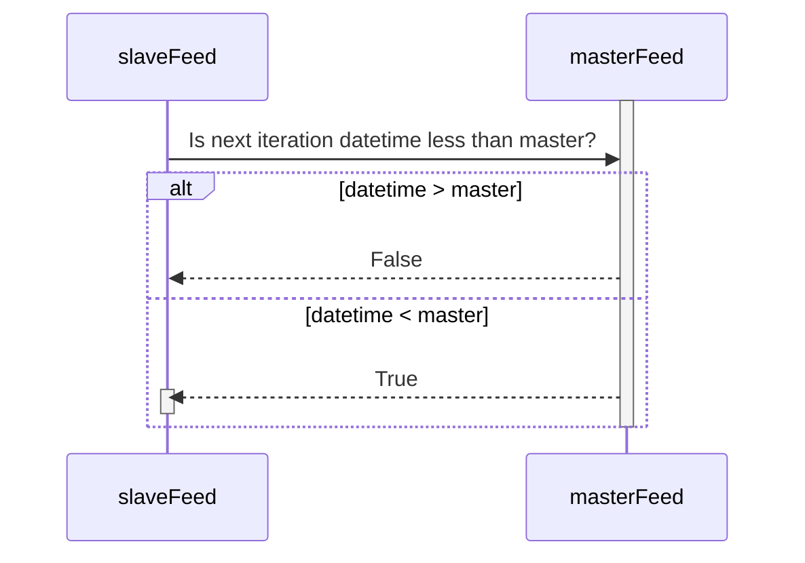

# Rough Ideas

## feeds

Feeds simulate the evolution of live n-dimensional data as iterable steps within a loop. The data is initially cached within the feed object and after each iteration step an incremental slice of the data is exposed.

### Feed

A Feed is the abstract base class for all feeds. Feed objects can have a master slave relationship. In this relationship the master feed is called during an iteration step, and every slave feed is iterated only if the date time of the next step is less than that of the master feed.

#### CSV

Inherits from the Feed base class. They act as an interface between CSV files and feeds.

##### OHLCV

Are feeds which inherit from CSV feeds. They read a CSV file and convert the file into a feed containing the price data.

## markets

A market refers to objects containing feed data about the exchange between assets. These feeds not only refer to price data, but to historical data which help to describe market sentiment. Markets evolve over time, hence markets iterate over the stored feeds. To ensure that the feeds evolve at the correct rate the feed which progresses along the smallest time frame, will be used as the master feed for all other feeds.

## wallets

A wallet refers to a storage object of some asset linked to a specific family of market e.g. spot, margin, futures.

### SpotWallet

During a trade two spot markets are linked via a SpotOrder. Once the trade is verified the balance contained within the order is transferred over to the desired account.

### Margin Wallet

During a trade two margin wallets are linked via either a MarginPosition or MarginOrder. Once a trade is opened a position is initiated, which tracks the borrowed amount and liquidation level of the order.

### Futures Wallet

A futures wallet, unlike margin and spot wallets, is only for USDT. Like a margin wallet a FuturesPosition is initiated from a FuturesOrder.

## orders

Orders link wallets with markets. Once an order is initiated by a trader it is stored by the designated market and during each forward step it is queried. If the order is filled the appropriate balance is transferred to/between wallets. For leveraged markets a position is initialized.

## Wallet, Order Position Dynamics

NotImplemented